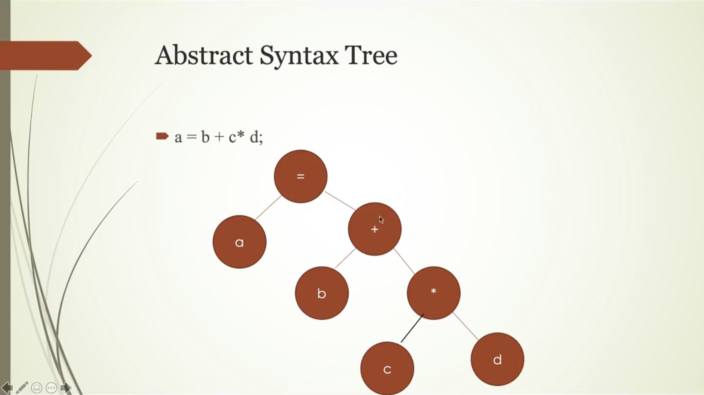

# Python

## Programming ( Problem Solving )

- Computer is a programmable machine.
- Business Problem တွေကို Solving လုပ်ပေးတာကို Programming လို့ခေါ်တယ်။

## Programming Language

Computer နဲ့ လူတွေကြားမှာ သုံးသော Language တစ်ခုဖြစ်ပါတယ်။ Computer သည် Electronic Device ဖြစ်ပါတယ်။ Computer သည် Binary
ကိုပဲ နားလည်တယ်။

| Programming Process | Workflow                     |
|---------------------|------------------------------|
| hardware            |                              |
| Machine Language    | binary(10101010101010)       |
| Assembly            | textual(add a,b)             |
| C++                 | `cout<<"Hello"`              |
| Python              | `print('Hello From Python')` |

## Assembly Language

Assembly Language သည် machine code အပေါ်မှာပဲ ရှိတယ်။ Machine Code ကို Assembly Language (Textual) နဲ့ပြတာကို Assembly
Code လို့ခေါ်တယ်။

## Abstraction

Complex details တွေကို hide လုပ်ပြီးတော့ လွယ်ကူတဲ့ interface ကနေ သုံးလို့ရတယ်။ Complex ဖြစ်နေတဲ့ identies တွေကို hide
လုပ်ပြီးတော့ လွယ်ကူရိုးရှင်းတဲ့အရာအဖြစ် အစားထိုးတာကို abstraction လုပ်တယ်လို့ ခေါ်ပါတယ်။ Assembly Language သည် Machine
Language နဲ့ ရေးတဲ့ binary တွေကို hide လုပ်ပြီးတော့ textual နဲ့ရေးနိုင်တာကို abstraction လို့ခေါ်ပါတယ်။ Complex
ဖြစ်နေတဲ့အရာကို Complex ဖြစ်နေတဲ့အတိုင်းမသုံးပဲနဲ့ ပိုလွယ်ကူအရာအဖြစ် ထိန်းချုပ်လိုက်တာကို abstraction လို့ခေါ်ပါတယ်။

Assembly &rarr; Translator &rarr; Machine Language

## Translator

Programming Language တစ်ခုကနေ နောက် Language တစ်ခု ပြောင်းတာကို **Translator** လို့ခေါ်ပါတယ်။ Translator သည်လည်း Program
တစ်ခုဖြစ်ပါတယ်။ ဘာ Program လဲဆိုရင် Programming Language တစ်ခုကနေ နောက်ထပ် Language တစ်ခုကို ပြောင်းပေးတဲ့ Programm (or)
Software ဖြစ်ပါတယ်။ **Translator** သည် abstration ကို သုံးပြီးတော့ **Assembly** to **Machine Language**
ကိုပြောင်းပေးတယ်။

1. Compiler
2. Interpreter
3. Virtual Machine
4. Transpiler
5. JIT/AOT Compiler

## How to learn Programming Language ( Elements )

| Language   | How to Work                  |
|------------|------------------------------|
| Syntax     | Grammar                      |
| Semantics  | Behind the scenes            |
| Pragmatics | Short, Stout and Right usage |

## Compiler

C++ &rarr; Assembly (Intermediate Code) &rarr; Machine Code (native code)

- Get **Source Code**
- Transform **Intermediate Code**
- Transform **Intermediate Code to Native Code**

## Assembler

Assembly ကို compile လုပ်ပေးသော compiler ကို Assembler လို့ခေါ်တယ်။

## Interpreter

Python Interpreter သည် **Intermediate Code** ကို in memory မှာ ထုတ်တယ် အဲ့ code ကို cpu ပေါ်မှာ Run တယ်။ Interpreter သည်
**Source code** ကို **runtime** မှာ **Byte Code** ကိုပြောင်းပါတယ်။ Interpreter သည် Source code ကို line by line execute
လုပ်တာ မဟုတ်ပါဘူး Byte code ကိုပဲ line by line execute လုပ်ပါတယ်။ Interpreter တွေသည် compiler တွေထက် နှေးပါတယ်။

Source code &rarr; Byte Code (in memory) &rarr; Directly execute byte code

## Byte Code

Byte Code can be executed VM or Interpreter. Byte code is running on memory. Byte code ထုတ်တဲ့အချိန်မှာ Stack ကို
သုံးပြီး execute လုပ်တာဖြစ်တဲ့အတွက်ကြောင့် Stack base interpreter လို့ခေါ်ပါတယ်။

a + b + c

| push a |
|:-------|
| push b |
| push c |
| mult   |
| add    |

### Stack Based VM

- a = b + c \* d; (b=2, c=3, d=5)

### Push

Push လုပ်တဲ့အချိန်မှာ ပထမဆုံးစတဲ့ value ကို lowest level stack မှာ စ၍ push လုပ်ပါတယ်။

| Push on stack | Value |
|:--------------|:-----:|
| Push d        |   5   |
| Push c        |   3   |
| Push b        |   2   |

### Multiply

Multiply operation လုပ်တဲ့ အချိန်မှာ top level stack မှာရှိတဲ့ value နှစ်ခုကို pop လုပ်ပြီးတော့မှ multiply လုပ်တယ်။
multiply လုပ်ပြီးတဲ့အချိန်မှာ value ကို stack ပေါ်မှာ ပြန်တင်ပေးပါတယ်။

| Multiply on stack | Value |
|:------------------|:------|
| Mult              | 15    |
| Push b            | 2     |

### Add

Add operation သည်လည်း multiply လုပ်တဲ့ operation နဲ့ အတူတူပါပဲ။ value နှစ်ကို pop လုပ်ပြီးတော့မှ Add လုပ်တယ်။ Add
လုပ်ပြီးတဲ့အချိန်မှ value ကို stack ပေါ်ပြန်တင်ပေးပါတယ်။

| Add on stack | Value |
|:-------------|:------|
| Add          | 17    |

### Store A

| Store |    |
|-------|----|
| a     | 17 |

## Java/C# Approach?

Java Compiler &rarr; byte code &rarr; Mac &rarr; JVM on Mac
\
Java Compiler &rarr; byte code &rarr; Window &rarr; JVM on Window

## Performance

1. Compiler
2. Based VM
3. Interpreter

## VM

Byte code &rarr;
\
Interpret
\
Byte code to native code &rarr; JVM Compiler

## Hotspot Compilation

Classes တွေမှာ သုံးကြိမ်လေးကြိမ်ထပ် သုံးတဲ့ code တွေကို compile လုပ်တဲ့အချိန် မှာ hotspot compilation ဖြစ်လာပါတယ်။

## JIT ( Just In Time Compilation )

Just in Time Compilation သည် byte code ကနေ native code ကို ပြောင်းလိုက်တာကို JIT လို့ခေါ်ပါတယ်။
JIT သည် byte code ရဲ့ တစ်စိတ်တစ်ပိုင်းကိုပဲ native code ပြောင်းတာဖြစ်ပါတယ်။

## AOT ( Ahead Of Time )

Byte Code ကို မ run ခင်မှာ native code ပြောင်းလိုက်တာကို AOT လို့ခေါ်ပါတယ်။ AOT ကတော့ Byte code အကုန်လုံးကို native code
အဖြစ်ပြောင်းလိုက်ပါတယ်။

## Transpiler

- High Level Language ( higher abstraction ) &rarr; High Level Language ( lower abstraction )
- TypeScript &rarr; Babel Transpiler &rarr; JavaScript ( Transpilation approach )
- JS ECMA 6 &rarr; Babel Transpiler &rarr; JS ECMA 5


## Lexical Analysis

Character String ကနေပြီးတော့ သက်ဆိုင်ရာ အသေးဆုံး unit တွေအဖြစ် ခွဲခြားလိုက်တာကို lexical analysis လို့ခေါ်ပါတယ်။

int a = 10;

| int |
|:---:|
|  a  |
|  =  |
| 10  |
|  ;  |

## Syntax Analysis

Grammar rule တွေအတိုင်း syntax မှန်မမှန် စစ်တာကို Syntax Analysis လို့ခေါ်ပါတယ်။

lst = [1,2,3,4,5 ❌

lst = [1,2,3,4,5] ✅

## What is Abstract Syntax Tree ( AST )



## Type System

1. Static Typed
2. Dynamic Typed

### Variable

Variable သည် memory အပေါ်မှာ cell တစ်ခုမှာ address အနေနဲ့ သိမ်းထားတာဖြစ်ပါတယ်။ variable သည် value ကို memory အပေါ်မှာ
သိမ်းလို့ရတယ် ပြန်ယူသုံးလို့ရတယ် ပြောင်းလို့ရတယ်။ Variable can store any type of value.

Variable &rarr; Store Value &rarr; Have Type

### Static Typed

Variable have type and cannot change type.

### Dynamic Typed

variable can store any type. value have type.

### Strongly Type

Invalid type operation တွေကို လုပ်ခွင့်မပေးဘူးဆိုရင် Strong Type လို့ခေါ်ပါတယ်။ မတူညီတဲ့ Type ကို operation လုပ်တဲ့အခါ
လုပ်ခွင့်မပေးတာကို ဆိုလိုတာပါ။

### Weakly Type

Invalid type operation တွေကို လုပ်ခွင့်ပေးတာကို Weakly Type လို့ခေါ်ပါတယ်။

## Types of Data

1. Integers ( Number )
2. Float ( 3.4 )
3. Boolean ( Ture & False )
4. String ( 'Hello', "Hello", """Hello""" )
5. Complex
6. Bytes
7. Bytearray

## Grammar of Assignment

`<variable> = <expression>`

```python
price = 1.5
quantity = 2
total = price * quantity
print('Total is ', total)
```

### Read and write

Variable တွေသည် assignment operator တွေရဲ့ right မှာရှိရင် read လုပ်တာဖြစ်ပါတယ်။ left မှာရှိရင် write လုပ်တာဖြစ်ပါတယ်။

### Expression

value တစ်ခုကို ပြန်ထုတ်ပေးနိုင်ရင် expression ဖြစ်ပါတယ်။

Types of Expression

- simple expression

```python
price = 1.5
quantity = 2
```

- complex expression

```python
price = 1.5
quantity = 2
total = price * quantity
```

### Variable Naming Conventions

- class Camel Case
- Other lowercase\_
- Constant All Capital
- Must start with letter or underscore
- Start With Letter

```python
var_name = "Hello World"
print(var_name)
```

- Start With Underscore

```python
_var_name = "Hello World"
print(_var_name)
```

- Cannot start with a digit

```python
# 2_var_name = "Hello World"  # error
# print(2_var_name)  # error
```

- Can have up to 256 total characters

- Can include letters, digits, underscores, dollar signs

```python
_var_name3 = "Hello World"
print(_var_name3)
```

- Cannot contain spaces

```python
varname = "Hello World"  # error
print(varname)  # error
```

- Cannot contain math symbols (+, -, /, \*, %, parentheses)

- Camel Case

```python
varName = "Hello World"
print(varName)
```

- Case Sensitivity

## Comment

Documentation purposes

```python
# print('hello world')
```

## Arithmetic Operators

Arithmetic should only apply to number type.

### Binary Operator

- Add `+`
- Subtract `-`
- Multiply `*`
- Divide `/`
- Integer Divide `//`
- Power `**`
- Remainder `%`
- Grouping `()`

```python
a = 10
b = 3

print('Sum ', a + b)  # 13
print("Subtract ", a - b)  # 7
print("Mult ", a * b)  # 30
print("Div ", a / b)  # 3.3333333333333335 # floating point division
print("Interger Division ", a // b)  # 3  # integer division
print("Power ", a ** b)  # 1000
print("Remainder ", a % b)  # 1
```

Operand အရေအတွက် ၂ ခု လိုက်ရတဲ့ အတွက် binary operator လို့ခေါ်တာဖြစ်ပါတယ်။

| +    | Operation |
|:-----|:----------|
| a, b | Operand   |

#### Unary Operator

```python
c = -10
print('-c ', +-c)  # 10
```

### Order

```python
a = 10
b = 3
c = 4

print('a + b * c ', a + b * c)  # 22
```

## Integer

Integer in Literal

### What is literal?

literal is immediately value.

```python
num_in_dec = 23  # literal
print(num_in_dec)
```

### Integer in Binary

only can use 0 or 1

```python
num_in_binary = 0b11
print("Number in binary 0b11 => ", num_in_binary)  # 3
```

### Integer in Octal

only can use 0 to 17

```python
num_in_octal = 0o17
print("Number in octal 0o17 => ", num_in_octal)  # 15
```

### Integer in Hexa

```python
num_in_hex = 0x10
print("Number in hexa 0x10 => ", num_in_hex)  # 16
```

### Check Hexa

hex() သည် language ကပေးထားသော api လေးတွေဖြစ်ပါတယ်။ language မှာပါလာပြီးသာ function တွေဖြစ်ပါတယ်။

```python
print("32 in hexa => ", hex(32))  # 0x20
```

### Check Octal

```python
print("32 in octal => ", oct(32))  # 0x20
```

### Check Binary

```python
print("32 in binary => ", bin(32))  # 0b100000
```

### Calculation hexa and octal

```python
x = 0x20
y = 0o40
print("x + y ", x + y)  # 64
```

## Floating Point

float is not exactly.

```python
my_float = 23.
print('my float', my_float)  # 23.0
print('my float type', type(my_float))  # <class 'float'>
```

### Floating point scientific notation

```python
my_float = 1.1e2
print('my float', my_float)  # 110.0
```

```python
print('0.3 - 0.2', 0.3 - 0.2)  # 0.09999999999999998
```

### Zero

[Different zero](https://www.facebook.com/thet.khine.587/posts/pfbid0nH8fV5jh5a7pLvSbEx8v32Gk3mh5UDwP31K4QtL4s5sodq5dEHdGzCrvF7Gaz3ial)

## Boolean

1. True ( calculation in number 1 )
2. False ( calculation in number 0 )

```python
flag = True
print("flag is", flag)  # True

flag = False
print("flag is", flag)  # False

x = 10
print("x + flag", x + flag)  # 10
```

## String

String is immutable.

- ' ' ( Single Quotes )

```python
my_str = 'Hello'
print("my_str ", my_str)
```

- " " ( Double Quotes )

```python
my_str = "Hello"
print("my_str ", my_str)
```

- """ """ ( Triple Quotes for **_Multi Line String_** )

Triple code string can used as comment.

```python
my_str = """This is multiline string
Another Line
"""
print("my_str ", my_str)

"""This is comment
comment second
"""
```

### Escape Sequence ( \ )

```python
my_str = 'Hello "How are you" I\'m fine'
print("my_str ", my_str)
```

## Type Casting

type တစ်ခုခုကနေပြီးတော့ နောက်ထပ် type တစ်ခုခုကိုပြောင်းတာကို type casting လို့ခေါ်ပါတယ်။

### int()

Default အားဖြင့် Base 10 ကိုပဲ Type Convert လုပ်လို့ရပါတယ်။

```python
my_str = '123'
my_num = 10

print("my_str + my_num", int(my_str) + my_num)  # 133
print("int(' 1000 ')", int(' 1000 '))  # 1000
# print("int(' 10.1 ')", int(' 10.1 ')) # invalid literal
# print("int('0x10')", int('0x10')) # invalid literal
print("int(True)", int(True))  # 1
print("int(False)", int(False))  # 0
print("int()", int())  # 0

```

### float()

```python
print("float(' 1000 ')", float(' 1000 '))  # 1000.0
print("float(' 10.1 ')", float(' 10.1 '))  # 10.1
# print("int('0x10')", float('0x10'))  # invalid literal
print("float(True)", float(True))  # 1.0
print("float(False)", float(False))  # 0.0
print("float()", float())  # 0.0
```

### bool()

Falsely Value

1. False
2. 0
3. ""
4. []
5. ()

```python
print("bool(0) ", bool(0))  # False
print("bool(1) ", bool(1))  # True
print("bool(0.0) ", bool(0.0))  # False
print("bool(1.0) ", bool(1.0))  # True
print("bool('False')", bool("False"))  # True
print("bool('')", bool(''))  # False
print("bool([])", bool([]))  # False
print("bool([1])", bool([1]))  # True
print("bool(())", bool(()))  # False
```

## ID

ID is unique identifier.

```python
x = 10
y = 20

print("Id of x", id(x))  # 4366905824
print("Id of y", id(y))  # 4366906144

print("Id of x", hex(id(x)))  # 0x1061eb1e0
print("Id of y", hex(id(y)))  # 0x1061eb320

x = 10
y = 10

print("Id of x", id(x))  # 4360073696
print("Id of y", id(y))  # 4360073696

print("Id of x", hex(id(x)))  # 0x103e171e0
print("Id of y", hex(id(y)))  # 0x103e171e0
```

C code level မှာ 10 တန်ဖိုးကို interpreter ထဲမှာ အသစ်ထပ်ပြီး create မလုပ်တော့ပဲ ရှိပြီးသား 10 တန်ဖိုးကို
ပြန်ပြီးယူသုံးလိုက်ခြင်းအားဖြင့် storage space ( or ) memory ကို သက်သာစေပါတယ်။

```python
x = 500
y = 500


def hello():
    k = 500
    print("id of k ", hex(id(k)))


hello()  # 0x101832ea8
print("Id of x ", hex(id(x)))  # 0x101832ea8
print("Id of y ", hex(id(y)))  # 0x101832ea8
```

same memory location ရှိနေလားကို စစ်ချင်ရင် id နဲ့ မစစ်ပဲနဲ့ `is` နဲ့ စစ်သင့်တယ်။ id are not same in python2.

```python
x = 1500
y = 1500
print("x is y ", x is y)


def hello():
    k = 1500
    print("id of k ", id(k))


hello()  # 4333236688
print("Id of x ", id(x))  # 4333236688
print("Id of y ", id(y))  # 4333236688
```

- run with python3

```bash
x is y  True
id of k  4310561232
Id of x  4310561232
Id of y  4310561232
```

- run with python2

```bash
('x is y ', True)
('id of k ', 140194292463392)
('Id of x ', 140194292463344)
('Id of y ', 140194292463344)
```

## Bytes `bytes()`

bytes must be in range 0 to 256. Bytes သည် ပြောင်းလဲခြင်း(mutate) လုပ်လို့မရပါဘူး။ bytes ကို read လုပ်မယ်ဆိုရင်တော့
bytes() ကိုသုံးသင့်ပါတယ်။

```python
x = [0, 10, 25, 30]
my_bytes = bytes(x)

print("my_bytes", my_bytes)  # b'\x00\n\x19\x1e'
print("type my_bytes", type(my_bytes))  # <class 'bytes'>
print("my_bytes[1]", my_bytes[1])  # 10
```

## Byte Array `bytearray()`

byte array is immutable. write လုပ်မယ်ဆိုရင်တော့ bytearray() ကို သုံးသင့်ပါတယ်။

```python
x = [0, 10, 25, 30]
my_bytes = bytearray(x)

print("my_bytes", my_bytes)  # bytearray(b'\x00\n\x19\x1e')
print("type my_bytes", type(my_bytes))  # <class 'bytearray'>
print("my_bytes[1]", my_bytes[1])  # 10

my_bytes[0] = 100
print("my_bytes", my_bytes)  # bytearray(b'd\n\x19\x1e')
print("my_bytes", my_bytes[0])  # 100
```

## List `[]`

- List is **Collection of values ( or ) variables**.
- List ကို index or အခန်းနံပါတ်တွေနဲ့ ပြန်ခေါ်သုံးလို့ရပါတယ်။
- List is **heterogeneous**. ( Types တွေ အများကြီးပါလို့ရတယ် )
- List is **Linear Data Structure**
- List is **mutable**
- List သည် same collection ကို သိမ်းတဲ့အခါမျိုးမှာ ပိုပြီးတော့ အသုံးပြုကြပါတယ်။

```python
ages = [10, 20, 28, 45, 18]
print("Ages ", ages)  # [10, 20, 28, 45, 18]
print("Ages[0] ", ages[0])  # 10
print("Ages[3] ", ages[3])  # 45
print("Len ", len(ages))  # 5
print("Sum ", sum(ages))  # 121
print("Average ", sum(ages) / len(ages))  # 24.2

ages.append(20)
print("Ages ", ages)  # [10, 20, 28, 45, 18, 20]
ages.remove(18)
print("Ages ", ages)  # [10, 20, 28, 45, 20]
```

## Tuple `()`

- Tuple is **immutable**
- Tuple can only readable.
- Tuple သည် different collection ကို သိမ်းတဲ့ အခါမျိုးမှာ ပိုပြီးတော့ အသုံးပြုကြပါတယ်။

```python
ages = (10, 20)
print("ages ", ages)  # (10, 20)
print("ages[0] ", ages[0])  # 10
print("ages[1] ", ages[1])  # 10
print("len ages ", len(ages))  # 2
print("type of ages ", type(ages))  # <class 'tuple'>

mg_mg = ("Mg Mg", 13, "UCSY")
print("mg mg ", mg_mg[0])  # Mg Mg
```

## Range `range()`

- range ကို looping ပတ်တဲ့ အခါမှာ အဓိကသုံးပါတယ်။
- range ကို counter control လုပ်ဖို့အတွက်သုံးပါတယ်။

### Range Syntax

- `range(stop)`
- `range(start, stop, step)`

```python
x = range(3)
print("type of x ", type(x))  # <class 'range'>
print("x ", x)  # range(0, 3)

for i in range(1, 10, 2):
    print(i)
```

## Set `{} | set()`

- Set is **mutable**
- List ထဲကနေ duplicate value တွေကို ဖယ်ချင်တဲ့ အခါမှာ set ကိုသုံးတယ်။
- Unique Element ကို သိမ်းချင်တယ်ဆိုရင် `set` ကိုသုံးလို့ရတယ်။
- Set သည် order ကို presearch မလုပ်ဘူး။

```python
my_set = {3, 1, 2, 10, 11, 1}
print("my_set ", my_set)  # {1, 2, 3, 10, 11}

my_set = set([3, 1, 2, 10, 11, 1])
print("my_set ", my_set)  # {1, 2, 3, 10, 11}

my_set.add(100)
print("my_set ", my_set)  # {1, 2, 3, 100, 10, 11}

my_set.remove(11)
print("my_set ", my_set)  # {1, 2, 3, 100, 10}
```

## Frozenset `frozenset()`

- frozen set is immutable
- `frozenset(set)`

```python
my_set = {3, 1, 2, 10, 11, 1}
frozen_set = frozenset(my_set)

print('frozen set ', frozen_set)
# frozen_set.add(100);
```

## Dictionary

- dictionary မှာ key & value ရှိတယ်။ key သည် unique ဖြစ်ဖို့လိုပါတယ်။
- dictionary ကို accept လုပ်တဲ့ အခါမှာ key နဲ့ accept လုပ်ရပါတယ်။

```python
students = {"roll-1": "Mg Mg", "roll-2": "Aung Aung"}

print("Dictionary ", students)

print("Get roll-1 ", students.get('roll-1'))

students['roll-2'] = 'Hla Maung'
print("Dictionary ", students)
```

## Input Function

- python program တွေမှာ ပြင်ပက data input တွေကို လိုချင်ရင် input function ကိုသုံးလို့ရပါတယ်။
- input က string ကို return ပြန်ပေးမယ်။ ထို့ကြောင့် arithmetic operation တွေ လုပ်တဲ့ အခါမှာ string
  ဖြစ်တဲ့ အတွက်ကြောင့် `+` ဆိုရင် string concat လုပ်ပေးသွားမှာပဲ ဖြစ်ပါတယ်။ ထို့ကြောင့် type cast
  လုပ်ပေးရပါတယ်။

### Input Function Syntax

`input()`

```python
x = float(input("Enter x"))
y = float(input("Enter y"))

print("Add ", x + y)
print("Sub ", x - y)
print("Div ", x / y)
print("Mult ", x * y)
```

## Eval Function

- eval function သည် string နှစ်ခုကို evaluate လုပ်တာဖြစ်ပါတယ်။
- eval function ထဲမှာ python code တွေရေးလို့ရတယ်။

```python
x = float(input("Enter x"))
y = float(input("Enter y"))

equation = input("Enter equation ")
z = eval(equation)
print("Output ", z)
```

## Command Line Arguments

- console program ကို ပေးရဲ့ argument ကို command line လို့ခေါ်တယ်။
- command line သည် list နဲ့ရပါတယ်။

```python
from sys import argv

print("No of command line argument ", len(argv))
print("command line arguments ", argv)
```

## Delete

- variable တွေကို ဖျက်ချင်ရင် delete `del` ကိုသုံးလို့ရပါတယ်။
- variable တွေကို ဖျက်မယ်ဆိုရင်တော့ မသုံးသင့်ဘူး။
- Object ထဲက element တွေကို ဖျက်မယ်ဆိုရင်တော့ သုံးသင့်ပါတယ်။

```python
x = 10
print("x is ", x)

del x
# print("x is", x)
```

## Operator

- Operation လုပ်တဲ့ကောင်တွေကို operator လို့ခေါ်ပါတယ်။
- Type ပေါ်မှာ မူတည်ပြီးတော့ ဘယ် operation လုပ်လို့ရမယ်ဆိုတဲ့ ကန့်သတ်ချက်တွေတော့ ရှိတယ်။

operator &rarr; `+, -, /, *`
\
a+b &rarr; operand

### Arithmetic Operator

`+, -, /, *`

- arithmetic operator တွေသည် type တူမှ operation လုပ်လို့ရတယ်။
- arithmetic operator တွေရဲ့ type တွေသည် ကြီးတဲ့ ကောင်တွေရဲ့ type ကိုယူပြီးတော့ output ထုတ်ပေးတယ်။ (float သည် integer
  ထက်ကြီးပါတယ်)

### Relational Operator

- Less than equal `<=`
- Less than `<`
- Greater than equal `>=`
- Greater than `>`

1. relational operator သည် Boolean ကို output ထုတ်ပေးတယ်။
2. relational operator တွေမှာ string တွေကို dictionary order နဲ့ စစ်ပါတယ်။
3. relational operator တွေမှာ list, tuple တွေကို element တစ်ခုချင်းစီကို တိုက်စစ်ပါတယ်။

```python
x = 20
y = 15

print("x < y ", x < y)
print("x > y ", x > y)
print("10 >= 10", 10 >= 10)
print("10 <= 10", 10 <= 10)

print("'apple' > 'orange'", 'apple' > 'orange')  # False
print("'apple' < 'orange'", 'apple' < 'orange')  # True

# print("'apple' < 3", 'apple' < 3)  # True
print("True > True", True > True)
print("True > False", True > False)

print("True > 10", True > 10)

print(" 3 > 2 > 1 ", 3 > 2 > 1)  # 3 > 2 and 2 > 1
print("True > 1 ", True > 1)
```

### Equality Operator

- Equal `==`
- Not Equal `!=`

```python
print("10 == 10", 10 == 10)
print("10 != 10", 10 != 10)

lst1 = [10, 20, 50]
lst2 = [10, 20, 50]

print("lst1 == lst2", lst1 == lst2)
print("lst1 > lst2", lst1 > lst2)
print("lst1 < lst2", lst1 < lst2)

tp1 = (10, 20, 50)
tp2 = (20, 30, 40)

print("tp1 > tp2", tp1 > tp2)
print("tp1 < tp2", tp1 < tp2)
print("tp1 != tp2", tp1 != tp2)
print("tp1 == tp2", tp1 == tp2)
```

### Logical Operator

- And `and`
- Or `or`
- Not `not`

#### And Operator

```python
print("True and True", True and True)  # True
print("True and False", True and False)  # False
print("False and False", False and False)  # False
print("False and True", False and True)  # False
```

##### And Semantic

ဘယ်ဘက်က value သည် falsy ဖြစ်နေခဲ့မယ်ဆိုရင် ညာဘက်ကို ဆက်ပြီးအလုပ်မလုပ်တော့ဘူး။ truthy ဖြစ်တယ်ဆိုတော့မှ ညာဘက်ကို
အလုပ်လုပ်ပါတယ်။

- If left is truthy return right hand side.

```python
print(" 'Hello' and 1 ", 'Hello' and 1)  # 1
print(" 'Hello' and 300 ", 'Hello' and 300)  # 300
```

- If left is falsy return left hand side.

```python
print(" '' and 'Hello' ", '' and 'Hello')  # ''
print(" 0 and 'Hello' ", 0 and 'Hello')  # 0
print(" [] and 'Hello' ", [] and 'Hello')  # []
print(" () and 'Hello' ", () and 'Hello')  # ()
print(" False and 'Hello' ", False and 'Hello')  # False
```

#### Or Operator

```python
print("True or True", True or True)  # True
print("True or False", True or False)  # True
print("False or False", False or False)  # False
print("False or True", False or True)  # False
```

##### Or Semantic

ဘယ်ဘက်က truthy ဖြစ်ခဲ့ရင် ညာဘက်ကို ဆက်ပြီးတော့ အလုပ်မလုပ်တော့ဘူး။ falsy ဖြစ်နေတယ် ဆိုတော့မှ ညာဘက်ကို ဆက်ပြီးတော့
အလုပ်လုပ်ပါတယ်။

- If left is truthy return left hand side.

```python
print("True or True", True or True)  # True
print(" 'hello' or 0 => ", 'hello' or 0)  # hello
print(" 1 or 0 => ", 1 or 0)  # 1
print(" [1,20] or 0 => ", [1, 20] or 0)  # [1, 20]
```

- If left is falsy return right hand side

```python
print("False or 'Hello' ", False or 'Hello')  # Hello
print("'' or 'Hello' ", '' or 'Hello')  # Hello
print("'' or 1000 ", '' or 1000)  # 1000
print("[] or 1000 ", [] or 1000)  # 1000
```

#### Not Operator

not operator သည် true ကို false ပြောင်းတယ်။ false ကို true ပြောင်းတယ်။

```python
print("not True ", not True)  # False
print("not False ", not False)  # True
print("not 'Hello' ", not 'Hello')  # False
```

## Bitwise Operator

bitwise only accept number type.

- Bitwise **AND** `&`
- Bitwise **OR** `|`
- Bitwise **XOR** `^`
- Bitwise **Complement** `~`
- Bitwise **Left** `<<`
- Bitwise **Right** `>>`

### Bitwise AND Operator `&`

```python
x = 2
y = 3

print(" bin(2) ", bin(2))  # 0b10
print(" bin(3) ", bin(3))  # 0b11
print(" bin(2) & bin(3) ", 2 & 3)  # 2
print("True & False ", True & False)  # False


# print("'True' & False ", 'True' & False)

def get_true():
    print("Get True")
    return True


def get_false():
    print("Get False")
    return False


print("get_false() & get_true() ", get_false() & get_true())  # False
```

### Bitwise OR Operator `|`

```python
def get_true():
    print("Get True")
    return True


def get_false():
    print("Get False")
    return False


print("get_false() | get_true() ", get_false() | get_true())  # True
```

### Bitwise XOR Operator `^`

- True `0`
- False `1`

```python
print(" 2 ^ 3 ", 2 ^ 3)  # 1
```

### Bitwise Complement Operator `~`

```python
print(bin(2), ~2)  # 0b10 -3
```
